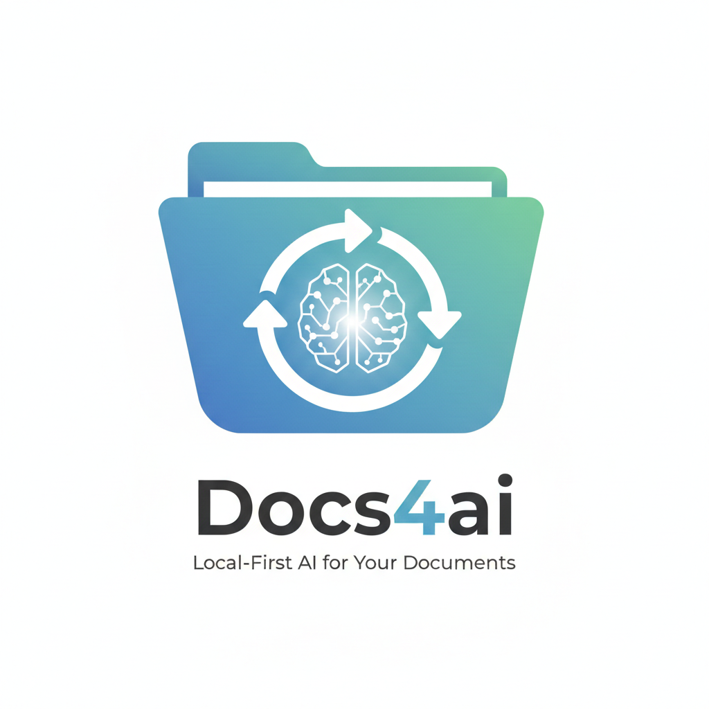

# Docs4ai - Local-First AI for Your Documents

<p align="center">
  
</p>

Search, chat, and map your documents with AI. Docs4ai syncs folders (and Google Drive) into a sqlite-vec index, exposes your data via a built-in MCP server, and can run entirely on-device using local embeddings and a local LLM across **macOS, Windows, and Linux**.

## Why Docs4ai

- Private-by-default: run fully on-device or use OpenAI for maximum quality
- Unified knowledge base from local folders and Google Drive
- Knowledge Map + chat UI for fast exploration and answers
- Built-in MCP server to connect external AI clients

## Install

These scripts build locally from source and install npm dependencies for you.

### macOS

```bash
bash -c 'git clone https://github.com/djannot/docs4ai.git && cd docs4ai && bash scripts/install-macos.sh'
```

### Linux

```bash
bash -c 'git clone https://github.com/djannot/docs4ai.git && cd docs4ai && bash scripts/install-linux.sh'
```

### Windows (PowerShell)

```powershell
powershell -Command "git clone https://github.com/djannot/docs4ai.git; cd docs4ai; .\scripts\install-windows.ps1"
```

## Supported file types

Documents: `.md`, `.txt`, `.pdf`, `.doc`, `.docx`, `.odt`, `.rtf`, `.pptx`, `.csv`

Web: `.html`, `.htm` (converted to Markdown)

More details in `DEVELOPERS.md#supported-file-types`.

## Supported languages

English, French, Spanish, Chinese, Hindi, Arabic, German, Italian, Portuguese.

## Embeddings and chat models

### Embeddings

| Provider | Model | Dimensions | Privacy | Best For |
|----------|-------|------------|---------|----------|
| **Local Qwen3 Embedding** | Qwen3 Embedding | 1024 | On-device | Private, offline indexing *(Recommended)* |
| **OpenAI** | text-embedding-3-large | 3072 | Remote | Highest quality semantic search |

### Chat LLM

| Provider | Model | Size | Privacy | Best For |
|----------|-------|------|---------|----------|
| **Local Qwen3** | 1.7B | ~1GB | On-device | Fast, private chat on modest hardware |
| **Local Qwen3** | 4B | ~2.5GB | On-device | Better answer quality with more local compute |
| **OpenAI** | Configurable | Cloud | Best quality with cloud models |

More model details in `DEVELOPERS.md`.

## Google Drive sync

Setup steps live in `GOOGLE_DRIVE.md`.

## Developer guide

For development setup, packaging, model details, schema, and troubleshooting, see `DEVELOPERS.md`.

## License

Apache License 2.0. See `LICENSE`.

Third-party notices: see `THIRD_PARTY_NOTICES`.
